## Share your Itineraries with your Readers

### A Freebie in Exchange for Their Email

Your readers will love to visit the same places you did.

### Kick up your Readers' Engagement

When your readers click on your shared itineraries, the trip is opened inside their **Travel Planner** instance, and you get a notification so you can recommend them related post, hotels, tours and things to do. Learn more on [how to monetize your readers' email list](/monetize-email-lists/).

## Readers can Bookmark Destinations from your Travel Posts

### A Travel Bucket List

Your readers can click on the hearts ❤️ shown by the plugin to **Bookmark your posts** and create their private travel bucket list.

### Increase your Returning Visitor Ratio

Attracting readers to your blog is a huge effort just for a unique visit. When your readers bookmark a destination in your post they will come back to your blog to check their destination wish lists.

## Organize a Trip from Bookmarked Destinations

### A Travel Planner for Your Blog

The plugin let your readers plan a trip based on the destinations stored in the **Destination Wish List**.

### Boost your Booking Affiliate Marketing

When your readers are ready to travel, they will book from the **Travel Planner** with your travel affiliate links. Being relevant in affiliate marketing is the doorway to success. [Learn more about affiliate marketing optimization](/affiliate-marketing).

