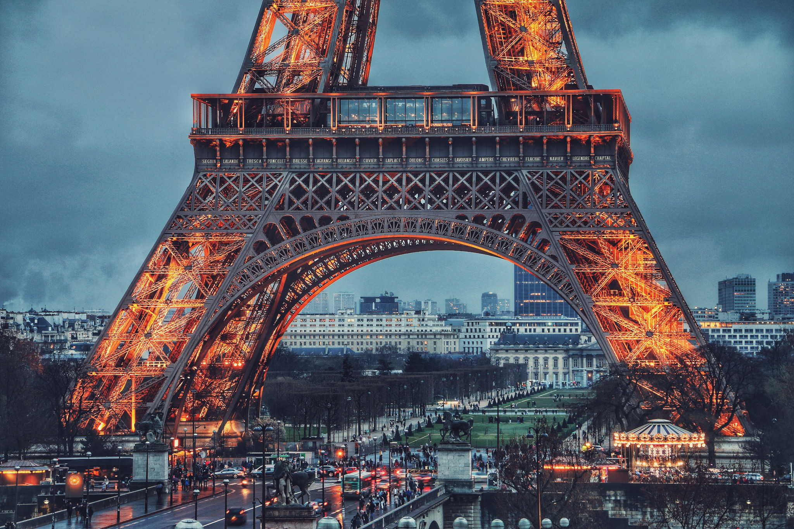

<StartWishToGo/>

# France <WishWidget country="FR"	picture="https://wish-to-go.com/images/for-wish-to-go/france/eiffel-tower-paris-soroush-karimi-IZ86s5eV4hA-unsplash.jpg"></WishWidget>

France has been the world's most popular tourist destination for quite some time. It received 83.7 million visitors in 2014, although these figures are highly skewed by the number of people who frequent the country for the weekend, particularly to visit Disneyland Paris, Europe's most popular visitor attraction. France is one of the most geographically diverse countries in Europe, containing areas as different from each other as urban chic Paris, the sunny French Riviera, long Atlantic beaches, the winter sports resorts of the French Alps, the castles of the Loire Valley, rugged Celtic Brittany and the historian's dream that is Normandy.

<CustomCategoryEntries className="blog-entry-card" category="city" tags="France"/>

## Popular Destinations

- [Paris](/travel/france/paris) <WishWidget country="FR" city="Paris" label="true" picture="https://wish-to-go.com/images/for-wish-to-go/france/louvre-paris-chris-karidis-PIOqHJG5a1U-unsplash.jpg" post="/travel/france/paris"></WishWidget>

	- [Château de Versailles (Versailles)](/travel/france/paris/#things-to-do)	<WishWidget country="FR" city="Paris" activity="Vesailles" post="/travel/france/paris/#things-to-do"></WishWidget>

	- [Notre Dame Cathedral](/travel/france/paris/#things-to-do)	<WishWidget country="FR" city="Paris" activity="Notre Dame" post="/travel/france/paris/#things-to-do" picture="https://wish-to-go.com/images/for-wish-to-go/france/notre-damme-sena-paris-steven-lasry--FB39Oo5J3c-unsplash.jpg"></WishWidget>

	- [The Louvre](/travel/france/paris/#things-to-do)	<WishWidget country="FR" city="Paris" activity="Louvre" picture="https://wish-to-go.com/images/for-wish-to-go/france/louvre-paris-jonathan-velasquez-eUSpDPSFdKU-unsplash.jpg"></WishWidget>

	- [Eiffel Tower](/travel/france/paris/#things-to-do)	<WishWidget country="FR" city="Paris" activity="Eiffel" picture="https://wish-to-go.com/images/for-wish-to-go/france/eiffel-paris-will-b-3ibjfWHHm0E-unsplash.jpg" post="/travel/france/paris/#things-to-do"></WishWidget>

- [Nice](/travel/france/nice) <WishWidget country="FR" city="Nice" picture="https://wish-to-go.com/images/for-wish-to-go/france/nice-street-paul-rysz-bLF3vK_X2Vc-unsplash.jpg"></WishWidget>

	- [Colline du Chateau](/travel/france/nice/#what-to-see)	<WishWidget country="FR" city="Nice" activity="Colline du Chateau" picture="" picture="https://wish-to-go.com/images/for-wish-to-go/france/nice-chateau-france-oscar-nord-UUOyS6WyKWs-unsplash.jpg"></WishWidget>

	- [Museum of Asian art](/travel/france/nice/#museums)	<WishWidget country="FR" city="Nice" activity="Museum of Asian Art"></WishWidget>

	- [Parc Phoenix](/travel/france/nice/#museums)	<WishWidget country="FR" city="Nice" activity="Parc Phoenix"></WishWidget>

	- [Musee Matisse](/travel/france/nice/#museums)	<WishWidget country="FR" city="Nice" activity="Musee Matisse"></WishWidget>

- [Strasbourg](/travel/france/strasbourg) <WishWidget country="FR" city="Strasbourg"></WishWidget>

	- [Maison Kammerzell](/travel/france/strasbourg/#what-to-see) <WishWidget country="FR" city="Strasbourg" activity="Maison Kammerzell"></WishWidget>

	- [L'Opéra](/travel/france/strasbourg/#what-to-see) <WishWidget country="FR" city="Strasbourg" activity="Opera House"></WishWidget>

	- [Petite France](/travel/france/strasbourg/#what-to-see) <WishWidget country="FR" city="Strasbourg" activity="Paetite France"></WishWidget>

	- [European district](/travel/france/strasbourg/#what-to-see) <WishWidget country="FR" city="Strasbourg" activity="European district"></WishWidget>

## Other Countries

<CustomCategoryEntries className="blog-entry-card more-of" category="country"/>