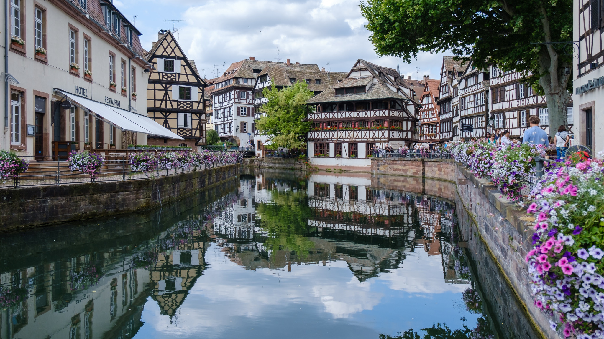
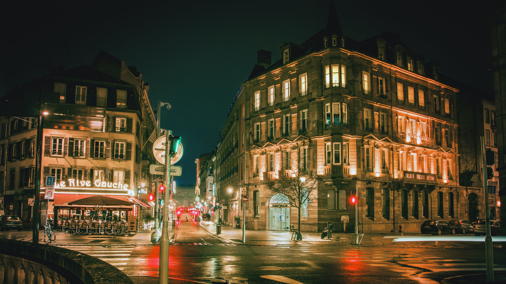
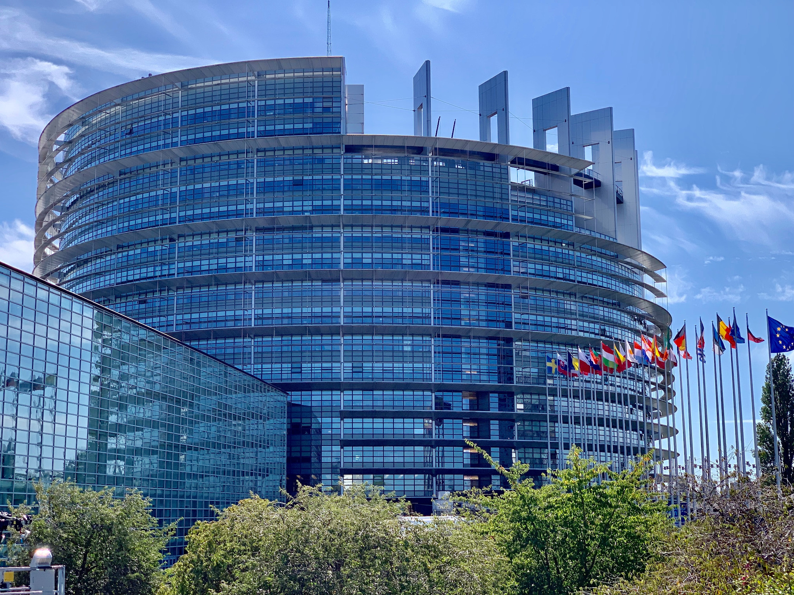

<StartWishToGo/>

# Strasbourg <WishWidget country="FR" city="Strasbourg" picture="https://wish-to-go.com/images/for-wish-to-go/france/strasbourg-petite-france-patrick-robert-doyle-xuVpSFtDZhI-unsplash.jpg"></WishWidget>

Strasbourg is the capital of the Alsace region of France and is most widely known for hosting a number of important European institutions. It is also famous for its beautiful historical centre —the _Grande Île_— which was the first city centre to be classified entirely as a World Heritage Site by UNESCO.

## What to see

- **Maison Kammerzell** <WishWidget country="FR" city="Strasbourg" activity="Maison Kammerzell"></WishWidget>

	To	the left in front of the cathedral, you can admire this 15th-century merchant's house with its intricately carved corbels, one of the	finest surviving examples of its kind in Europe. Inside is a hotel-restaurant, so if you want to see the interior you will have	to book a table.

- **L'Opéra** <WishWidget country="FR" city="Strasbourg" activity="Opera House"></WishWidget>

	Neoclassicist opera house, home of the opera company _L'Opéra National du Rhin_.

- **Petite France** <WishWidget country="FR" city="Strasbourg" activity="Petite France" picture="https://wish-to-go.com/images/for-wish-to-go/france/strasbourg-petit-france-david-leveque-ZL-SJTp9RBc-unsplash.jpg"></WishWidget>

	

	Petite France is the name given to the small area between the rivers, just south of the Grande Île. It is home to some of Strasbourg's prettiest and most photogenic streets and buildings, with half-timbered townhouses (*maisons à colombage*) leaning out over the narrow cobbled streets. Petite France resembles (a city an hour south), with picturesque canals and half-timber houses.

- **European district** <WishWidget country="FR" city="Strasbourg" activity="European district" picture="https://wish-to-go.com/images/for-wish-to-go/france/europaliament-fance-christian-wagner-fX-D68esJz4-unsplash.jpg"></WishWidget>

	

	Council of Europe's seat (*Le Palais de l'Europe*) (1977), built by Henry Bernard European Court of Human Rights (1995), built by Richard Rogers European Parliament (1999), built by Architecture Studio.

## More of France

<CustomCategoryEntries className="blog-entry-card more-of" category="city" tags="France"/>