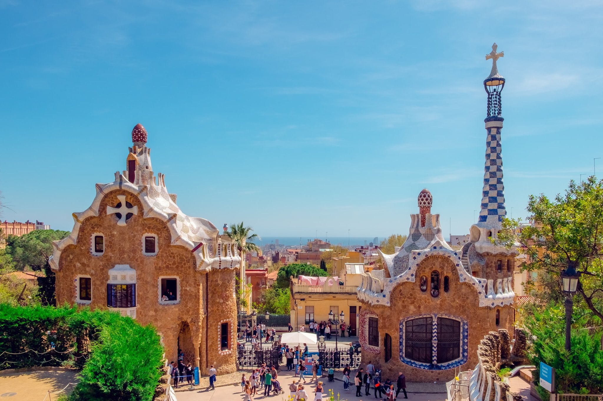
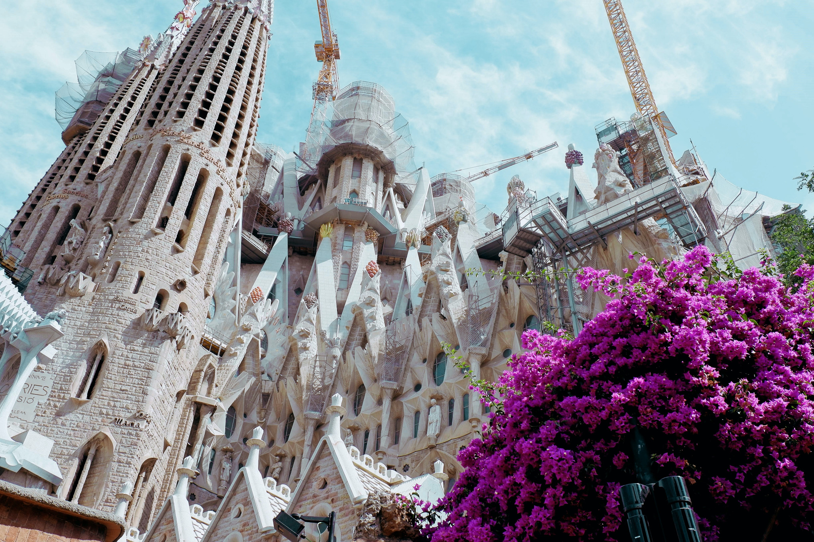
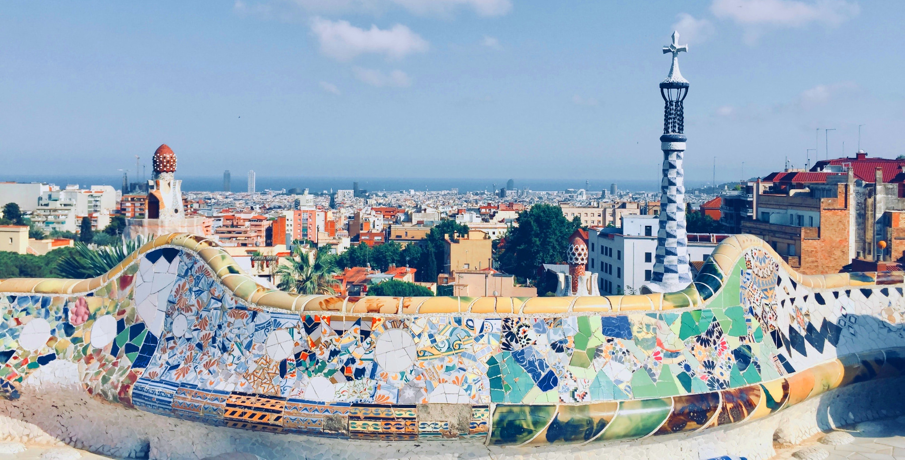
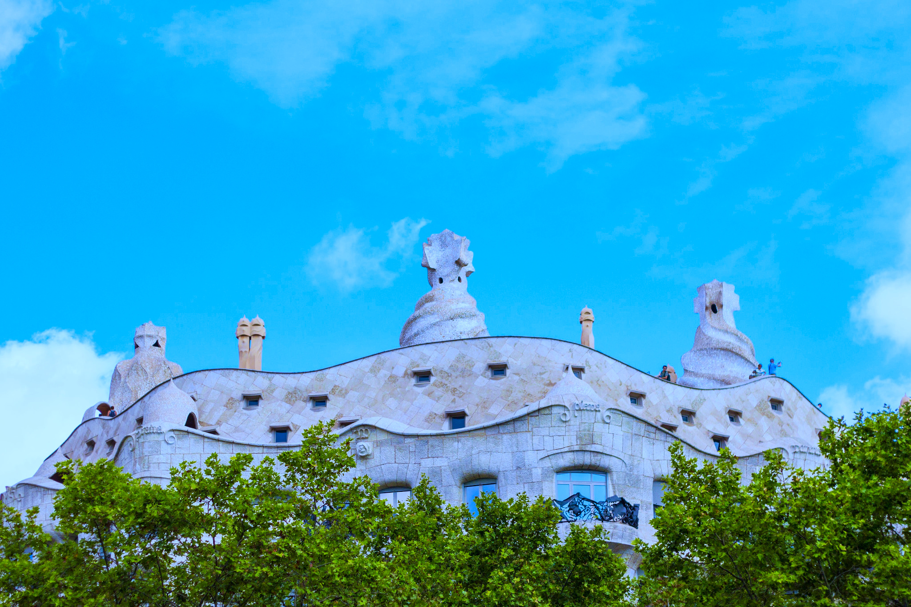

<StartWishToGo/>

# Barcelona <WishWidget	country="ES"	city="Barcelona"	picture="https://wish-to-go.com/images/for-wish-to-go/spain/parc-guell-daniel-corneschi-N6HTCyN50p0-unsplash.jpg"/>

Barcelona is always a city worth visiting and touring. If this is the first time you visit it, let yourself be seduced by the proposals we offer today, but you can also continue reading and taking note of our advice if you have already had the chance to see it, because this route does not appear in traditional travel guides. Lets know some activities and places to discover in Barcelona

## Things to do

### La Sagrada Familia <WishWidget	country="ES"	city="Barcelona"	activity="La Sagrada Familia" picture="https://wish-to-go.com/images/for-wish-to-go/spain/sagrada-familia-counter-barcelona-isaac-CmLrmQNYtII-unsplash.jpg" label/>

An obligatory stop in Barcelona is to visit the Sagrada Familia and calculate the time left to finish it. The church is also designed by Antoni Gaudí, like La Pedrera, and is considered one of the most visited monuments in Spain. It is said, that when finished it will be the tallest church in the world. For this reason and for its architectural art, it is worth visiting.

### Parc Guell 
<WishWidget country="ES"	city="Barcelona" activity="Parc Güell" picture="https://wish-to-go.com/images/for-wish-to-go/spain/parc-guell-vitor-monteiro-jiAv24Lc3T0-unsplash.jpg" label></WishWidget>

On the upper side of the Gracia district is the Park Güell, where the modernist spirit of Gaudí is once again reflected: undulating forms, geometric games, and colorful mosaics. It has an extension of 17 hectares. This park is considered one of the must-see places in Barcelona. 

### La Pedrera - Casa Milà
<WishWidget	country="ES" city="Barcelona" activity="La Pedrera" picture="https://wish-to-go.com/images/for-wish-to-go/spain/la-pedrera-top-barcelona-tyler-hendy-mCW21DwPxx8-unsplash.jpg" label></WishWidget>

Although Barcelona is characterized by the many modernist buildings that Antoni Gaudí has left us. Take a trip to the golden age of the city by walking along Passeig de Gracia, remember to look up and see the modernist buildings. The most famous is La Pedrera (Casa Milà) and next to it, on the other side of Paseig de Gracia street, there is **Casa Batlló** <WishWidget	country="ES" city="Barcelona" activity="Casa Batllo"></WishWidget>

### Museu Dalí
<WishWidget	country="ES" city="Barcelona"	activity="Museu Dalí" label="true"></WishWidget>

The Dalí Theatre-Museum most important surrealistic masterpiece in the world. Build on the Municipal Theatre remains.

## More of Spain

<CustomCategoryEntries className="blog-entry-card more-of" category="city" tags="Spain"/>