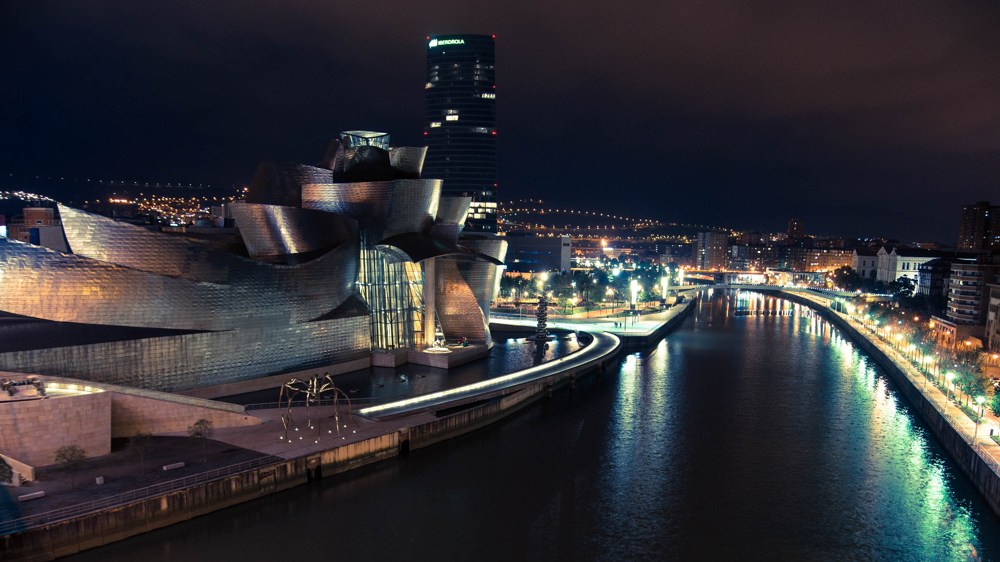
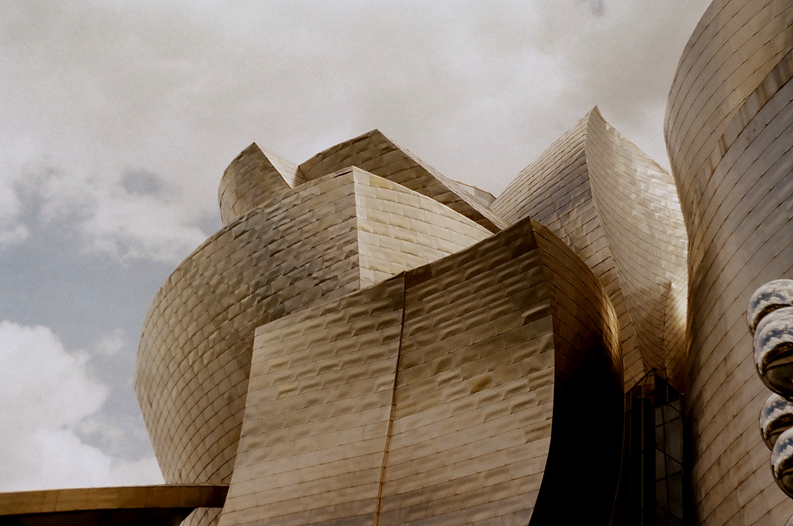
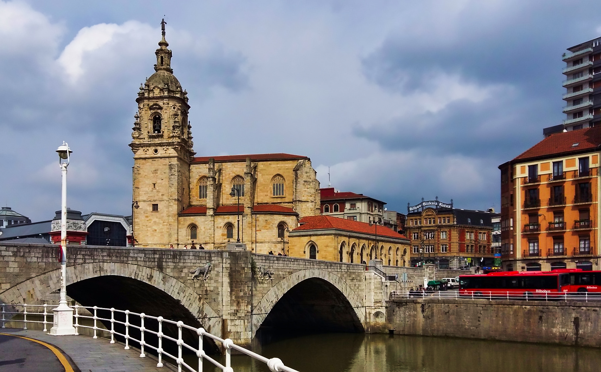
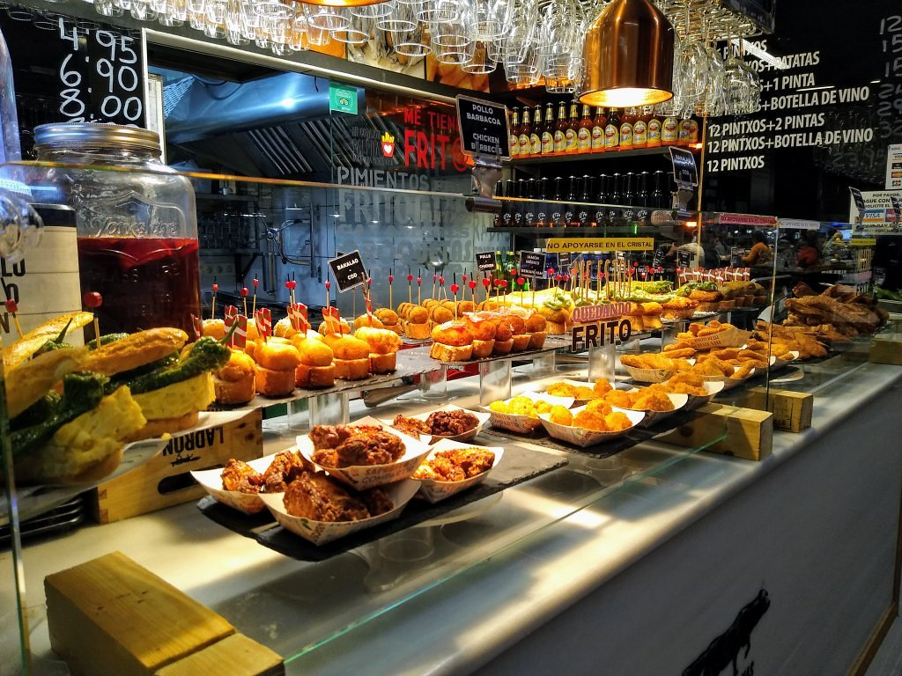

<StartWishToGo/>

# Bilbao <WishWidget country="ES" city="Bilbao" picture="https://wish-to-go.com/images/for-wish-to-go/spain/bilbao-ria-niclas-dehmel-bAfk_mr8VU4-unsplash.jpg"></WishWidget>

Bilbao, is the capital of the province of Biscay, in the autonomous community of the Basque Country, and has approximately 350,000 inhabitants. It is a city in constant expansion and never stops evolving. As the industries that used to occupy a large part of the banks of the estuary have disappeared, the city has left behind its sad and grey image and has become a cosmopolitan city, with a mixture of old buildings and others of a more contemporary architecture. For all these reasons, Bilbao today is a place worth visiting, paying attention to everything around it.

## Things to Do

### Alhóndiga
<WishWidget country="ES" city="Bilbao" activity="Alhondiga" label="true"></WishWidget>

The interior of this building has 43 columns decorated with striking shapes and colours, as well as an indoor swimming pool, whose floor is made of glass, so that visitors can observe how the users swim above their heads. In addition to the swimming pool, the building has movie theaters, an auditorium and several exhibition halls, as well as restaurants and cafes.

### Teatro Arriaga
<WishWidget country="ES" city="Bilbao" activity="Teatro Arriaga" label="true"></WishWidget>

It is a neo-baroque building from the end of the 19th century, designed by the architect Joaquín de Rucoba. In it, the lovers of the opera will be able to enjoy spectacles of dance, musicals, zarzuela and wonderful theatrical representations.

### Guggenheim
<WishWidget country="ES" city="Bilbao" activity="Guggenheim" picture="https://wish-to-go.com/images/for-wish-to-go/spain/guggenheim-bilbao-slava-kuzminsky-FQ8u2Ymcjt8-unsplash.jpg" label/>

It is the Bilbao museum par excellence, and is a must if you pass through the city. Its design, by Canadian architect Frank O.Ghery, does not go unnoticed. It was inaugurated on October 18, 1997. If the building is seen from the estuary, it resembles a boat, thus paying homage to the city and its shiny panels emulate the scales of a fish.

### Puente de San Antón
<WishWidget country="ES" city="Bilbao" activity="Puente de San Anton" picture="https://wish-to-go.com/images/for-wish-to-go/spain/puente-san-anton.jpg" label/>

Next to the _Iglesia de San Antón_ sits Bilbao's most emblematic bridge.

### Mercado de la Ribera
<WishWidget country="ES" city="Bilbao" activity="Mercado de la Ribera" picture="https://wish-to-go.com/images/for-wish-to-go/spain/mercado-de-la-ribera.jpg" label/>

It is the largest market in Bilbao, and the best known. It is located in front of the Nervión estuary and was remodelled in 2010, going from having a stone façade, to being mostly glazed, giving it more light and modernity.

### Plaza Nueva
<WishWidget country="ES" city="Bilbao" activity="Plaza Nueva" label/>

Here you can taste the best _pintxos_ in the whole city, as well as sit on one of its many terraces, as long as the weather in the north allows it.

## More of Spain

<CategoryEntries className="blog-entry-card more-of" category="city" tags="Spain"/>