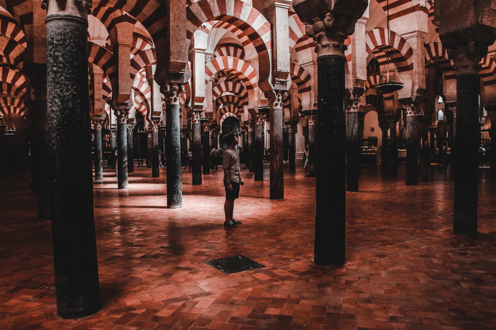
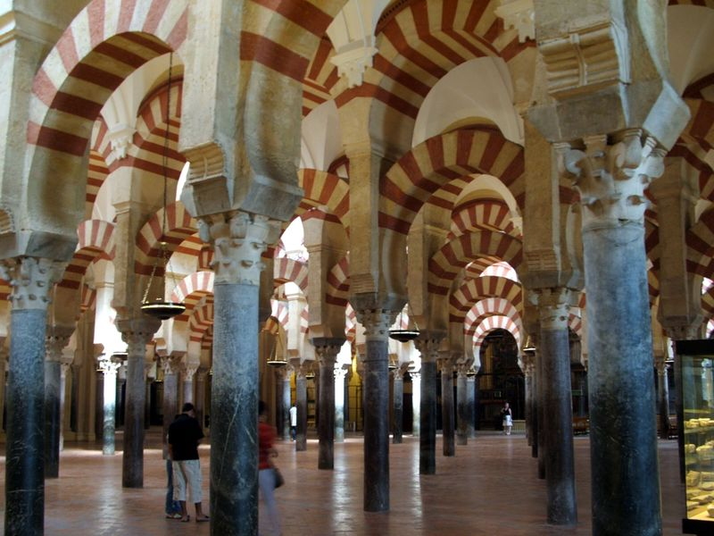
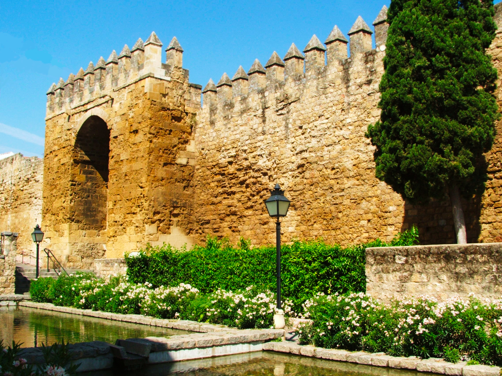
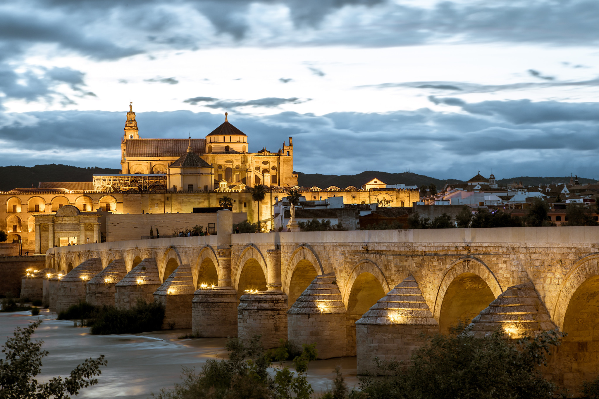
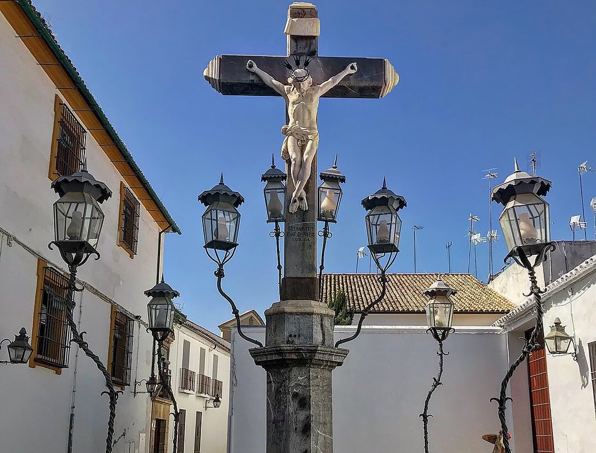

<StartWishToGo/>

# Cordoba <WishWidget country="ES" city="Cordoba" picture="https://wish-to-go.com/images/for-wish-to-go/travel/spain/mezquita-cordoba-eliott-van-buggenhout-q4Je53Uscck-unsplash.jpg"></WishWidget>

Cordoba is an incredible city in the autonomous community of Andalusia, it was the largest capital in Europe, surpassing Paris and Rome in its academic, architectural and artistic achievements. The historic centre of Cordoba, due to its architectural integrity and beauty, the result of the aggregation of several styles, is part of the UNESCO World Heritage Sites.

## The Mezquita
<WishWidget country="ES" city="Cordoba" activity="The Mezquita" picture="https://wish-to-go.com/images/for-wish-to-go/travel/spain/mezquita_arches_cordoba.jpg" label/>

The great mosque created for the Caliphate of Cordoba, an important Arab kingdom in Andalusia, is the only expression of Islamic architecture in the West. Its importance derives from the fact that the Renaissance, Gothic and Baroque styles were added to the beautiful Muslim construction, making it a unique building in the world, part of the sites protected by UNESCO as a World Heritage Site.

Inside the Mosque is the **Cathedral of Cordoba** <WishWidget country="ES" city="Cordoba" activity="Cathedral"></WishWidget>, built in the sixteenth century, is an artistic demonstration of the triumph of Christianity. At the time of its construction, the city's clergy decided to build a large Christian temple that could symbolize the importance of Cordoba. The project consisted in the demolition of an important part of the building of the great Mosque, breaking the perspective of the forest of columns and inserting a Christian cathedral in its place. Getting through one of the doors you'll find the **Patio de los Naranjos** <WishWidget country="ES" city="Cordoba" activity="Patio de los Naranjos"></WishWidget>.

### The Old City
<WishWidget country="ES" city="Cordoba" activity="The Old City" picture="https://wish-to-go.com/images/for-wish-to-go/travel/spain/citywall_cordoba.jpg" label/>

The castle of Almodóvar del Río is located 22 kilometres from Córdoba, in the city of Almodóvar del Río. It is an old Moorish military fortress dating from 740. Built in a strategic and advantageous position on the top of a hill, the castle is surrounded by a fortress that occupies more than 5,000 square meters. From its position, the fortress provided defence for the city of Cordoba. Visitors can walk through the ancient defence walls, towers, dungeons and underground passages.

- **Puente Romano** <WishWidget country="ES" city="Cordoba" activity="Puente Romano" picture="https://wish-to-go.com/images/for-wish-to-go/travel/spain/puente-romano-cordoba-saad-chaudhry-uYMyUKL1QSU-unsplash.jpg" label/>

	

	The Roman Bridge of Cordoba, located on the Guadalquivir River, is the only evidence of Roman settlement in the city. It is 240 metres long and rests on 16 arches with the statue in the centre of the sculptor Bernabé Gómez del Río, patron saint of Cordoba. Even today, the bridge is one of the main transit routes and the only way into the city. The bridge was originally designed after Caesar's victory over Pompey the Great and was later built by Augustus as the focal point of the Via Augusta.

- **Alcazar de los Reyes Cristianos** <WishWidget country="ES" city="Cordoba" activity="Alcazar de los Reyes Cristianos"></WishWidget>

	The Alcazar de los Reyes Cristianos, one of the most important and representative monuments of Cordoba, an impressive building built in 1327 by Alfonso XI and called so because it was inhabited by the "Catholic Kings". It is an interesting building where Roman and Visigoth remains coexist with the Arab remains, as it was a favourite place for different rulers since Roman times. Throughout History it has been given multiple uses, as the seat of the Holy Office (Inquisition), or prison (in the first half of the 19th century).

### Outside the Old City

- **Plaza del Cristo de los Faroles** <WishWidget country="ES" city="Cordoba" activity="Cristo de los faroles" picture="https://wish-to-go.com/images/for-wish-to-go/travel/spain/cristo-faroles-cordoba.jpg"></WishWidget>

	

	El Cristo de los Faroles es una escultura que Fray Diego José de Cádiz mando construir al escultor Juan Navarro León. Es una estatua muy querida en la ciudad. Se encuentra en la plaza de Capuchinos, el enclave donde se sitúa este Cristo lo hace muy especial.

- **Madina Azahara** <WishWidget country="ES" city="Cordoba" activity="Medina Azahara"></WishWidget>

  About 8 km from Cordoba and at the foot of the Cordoba mountain range of the same name, are the remains of Medina Azahara, declared a National Monument in 1923, one of the most important examples of 10th century Spanish-Muslim architecture. One of the most important archaeological sites in Spain, where the Umayyad Caliph Abd-al-Rahman III built a palace in the city with a capacity of 12,000 people.

## More of Spain

<CustomCategoryEntries className="blog-entry-card more-of" category="city" tags="Spain"/>