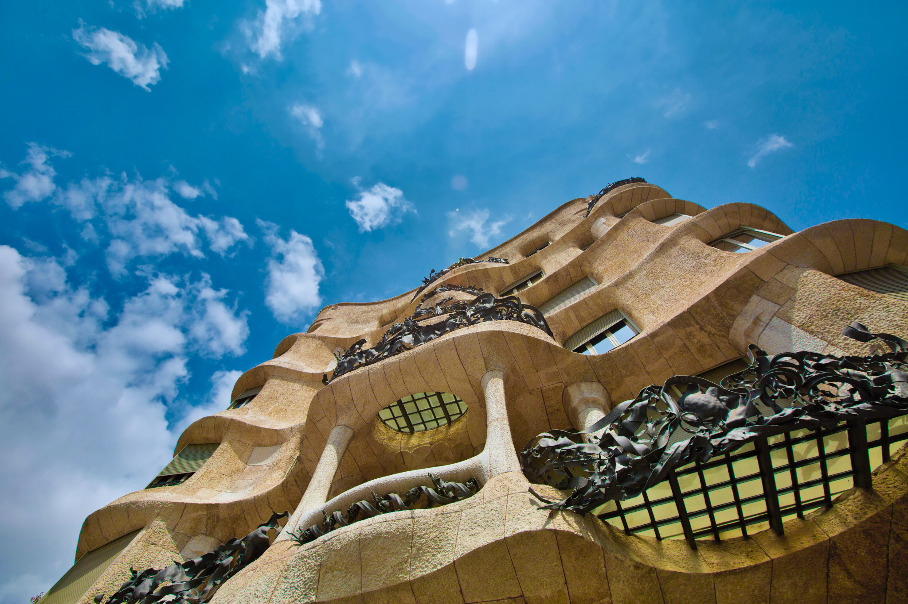

<StartWishToGo/>

# Spain <WishWidget	country="ES" picture="https://wish-to-go.com/images/for-wish-to-go/spain/la-pedrera-barcelona-tyler-hendy-OX1pKaIrXLY-unsplash.jpg"></WishWidget>

Spain has always been one of the favourite tourist places not only in Europe, but all over the world. And no wonder. Here are just a few of the reasons that make it one of the most successful tourist destinations.

It is a country equally rich in culture, art, gastronomy and entertainment. The mix of Gothic, Romanesque and Moorish architecture, bullfighting, unparalleled Spanish food and a sunny climate are some reasons why this country attracts thousands of visitors every month.
Madrid and Barcelona are the cities that receive most tourists each year. The Royal Palace, the Prado Museum, the Sagrada Familia or the architecture of Antonio Gaudí are just a few examples of what both European cities have to offer.

<ShareTripWidget user-id="5RgbbnW5uDZV0sofyNe3NWws1qs1" trip-name="Wish To Go Trip to Spain" icon-url="/images/blogger.png"></ShareTripWidget>

<CustomCategoryEntries className="blog-entry-card" category="city" tags="Spain"/>

## Popular Destinations

- [Barcelona](/travel/spain/barcelona) <WishWidget	country="ES"	city="Barcelona"	picture="https://wish-to-go.com/images/for-wish-to-go/spain/parc-guell-daniel-corneschi-N6HTCyN50p0-unsplash.jpg" post="/travel/spain/barcelona"></WishWidget>

	- [La Sagrada Familia](/travel/spain/barcelona/#la-sagrada-familia) <WishWidget	country="ES"	city="Barcelona"	activity="La Sagrada Familia" picture="https://wish-to-go.com/images/for-wish-to-go/spain/sagrada-familia-counter-barcelona-isaac-CmLrmQNYtII-unsplash.jpg" post="/travel/spain/barcelona/#la-sagrada-familia"></WishWidget>

	- [Park Güell](/travel/spain/barcelona/#parc-guell) <WishWidget country="ES"	city="Barcelona" activity="Parc Güell" picture="https://wish-to-go.com/images/for-wish-to-go/spain/parc-guell-vitor-monteiro-jiAv24Lc3T0-unsplash.jpg" post="/travel/spain/barcelona/#other-gaudi-architecture-and-modernist-barcelona"></WishWidget>

	- [La Pedrera](/travel/spain/barcelona/#la-pedrera) <WishWidget	country="ES" city="Barcelona" activity="La Pedrera" post="/travel/spain/barcelona/#other-gaudi-architecture-and-modernist-barcelona" picture="https://wish-to-go.com/images/for-wish-to-go/spain/la-pedrera-top-barcelona-tyler-hendy-mCW21DwPxx8-unsplash.jpg"></WishWidget>

	- [Casa Batlló](/travel/spain/barcelona/#casa-batllo) <WishWidget	country="ES" city="Barcelona" activity="Casa Batllo" post="/travel/spain/barcelona/#other-gaudi-architecture-and-modernist-barcelona"></WishWidget>

	- [Museu Dalí](/travel/spain/barcelona/#museu-dali)	<WishWidget	country="ES" city="Barcelona"	activity="Museu Dalí"></WishWidget>

- [Bilbao](/travel/spain/bilbao) <WishWidget country="ES" city="Bilbao" picture="https://wish-to-go.com/images/for-wish-to-go/spain/bilbao-ria-niclas-dehmel-bAfk_mr8VU4-unsplash.jpg"></WishWidget>

	- [Alhóndiga](/travel/spain/bilbao/#alhondiga) <WishWidget country="ES" city="Bilbao" activity="Alhondiga"></WishWidget>

	- [Birthplace of Miguel de Unamuno](/travel/spain/bilbao/#birthplace-of-miguel-de-unamuno) <WishWidget country="ES" city="Bilbao" activity="Alhondiga"></WishWidget>

	- [Teatro Arriaga](/travel/spain/bilbao/#teatro-arriaga) <WishWidget country="ES" city="Bilbao" activity="Teatro Arriaga"></WishWidget>

	- [Estación de Santander ](/travel/spain/bilbao/#estacion-de-santander) <WishWidget country="ES" city="Bilbao" activity="Estación de Santander"></WishWidget>

	- [Puente de San Antón](/travel/spain/bilbao/#puente-de-san-anton) <WishWidget country="ES" city="Bilbao" activity="Puente de San Anton"></WishWidget>

	- [Mercado de la Ribera](/travel/spain/bilbao/#mercado-de-la-ribera) <WishWidget country="ES" city="Bilbao" activity="Mercado de la Ribera"></WishWidget>

	- [Plaza Nueva](/travel/spain/bilbao/#plaza-nueva) <WishWidget country="ES" city="Bilbao" activity="Plaza Nueva"></WishWidget>

- [San Sebastian](/travel/spain/san-sebastian) <WishWidget	country="ES" city="San Sebastian"	picture="https://wish-to-go.com/images/for-wish-to-go/spain/la-concha-from-igueldo-san-sebastian-spain-raul-cacho-oses-wxem-o1RMWs-unsplash.jpg"></WishWidget>

	- [La Concha](/travel/spain/san-sebastian/#the-beach)	<WishWidget	country="ES" city="San Sebastian"	activity="La Concha" picture="https://wish-to-go.com/images/for-wish-to-go/spain/la-concha-donostia-kylie-paz-P8YcW1vvjpE-unsplash.jpg"></WishWidget>

	- [Ondarreta](/travel/spain/san-sebastian/#the-beach) <WishWidget	country="ES" city="San Sebastian"	activity="Ondarreta"></WishWidget>

	- [Aquarium](/travel/spain/san-sebastian/#other-attraction) <WishWidget	country="ES" city="San Sebastian"	activity="Aquarium"></WishWidget>

	- [Kayak](/travel/spain/san-sebastian/#other-attractions) <WishWidget	country="ES" city="San Sebastian"	activity="Kayak"></WishWidget>

	- [Water skiing](/travel/spain/san-sebastian/#other-attractions) <WishWidget	country="ES" city="San Sebastian"	activity="Water skiing"></WishWidget>

	- [Surf School](/travel/spain/san-sebastian/#other-attractions)<WishWidget	country="ES" city="San Sebastian"	activity="Puka Surf Eskola"></WishWidget>

- [Cordoba](/travel/spain/cordoba) <WishWidget country="ES" city="Cordoba"></WishWidget>

	- [The Mezquita](/travel/spain/cordoba/#the-mezquita) <WishWidget country="ES" city="Cordoba" activity="The Mezquita"></WishWidget>

	- [Patio de los Naranjos](/travel/spain/cordoba/#the-mezquita) <WishWidget country="ES" city="Cordoba" activity="Patio de los Naranjos"></WishWidget>

	- [Plaza del Cristo de los Faroles](/travel/spain/cordoba/#outside-the-old-city) <WishWidget country="ES" city="Cordoba" activity="Cristo de los faroles"></WishWidget>

	- [Madina Azahara](/travel/spain/cordoba/#outside-the-old-city) <WishWidget country="ES" city="Cordoba" activity="Medina Azahara"></WishWidget>

## Other Countries

<CustomCategoryEntries className="blog-entry-card more-of" category="country"/>