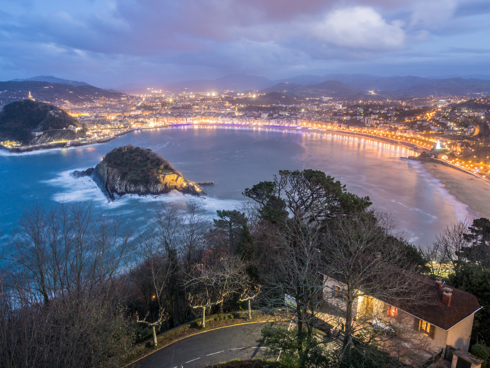
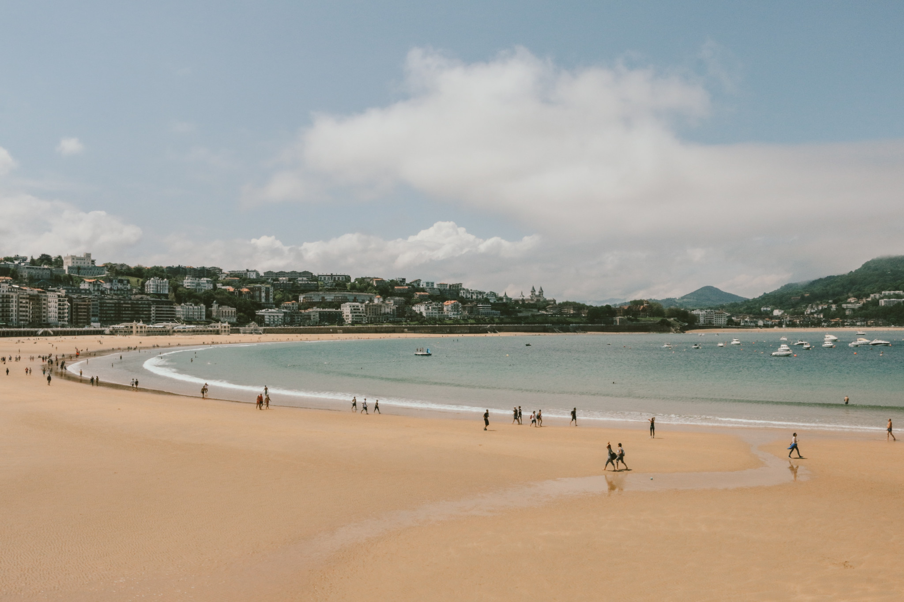
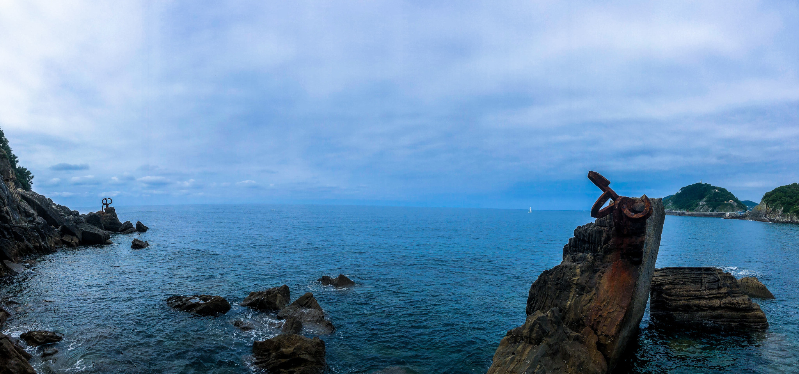
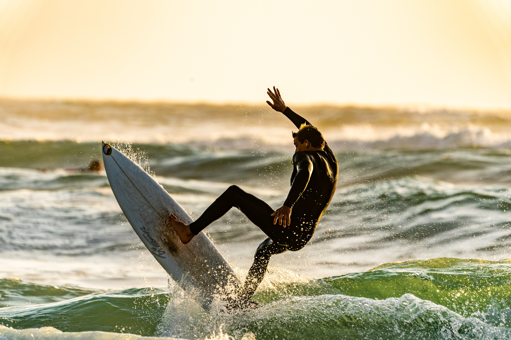

<StartWishToGo/>

# San Sebastian <WishWidget	country="ES" city="San Sebastian"	picture="https://wish-to-go.com/images/for-wish-to-go/spain/la-concha-from-igueldo-san-sebastian-spain-raul-cacho-oses-wxem-o1RMWs-unsplash.jpg"/>

San Sebastian is considered one of the most charming cities in Spain and one of the most beautiful in Europe. The three beaches in the city centre make it a special place to visit. Although the best time of year to visit is undoubtedly summer, you can enjoy San Sebastian at any time. It is a perfect city to visit on a weekend or on a long bridge.

All the main things to visit in the city are just a few kilometres away as we can see and it is very easy to get around on foot, although it is very important to have booked a hotel that is well located to save time on the way.

## Things to Do

### The Beach

There are two main beaches, one on either side of the river.

- **La Concha**	<WishWidget	country="ES" city="San Sebastian"	activity="La Concha" picture="https://wish-to-go.com/images/for-wish-to-go/spain/la-concha-donostia-kylie-paz-P8YcW1vvjpE-unsplash.jpg"/>

  

  La Concha is one of the most famous beaches in San Sebastian. It is quite long and is about one and a half kilometres long. It has a very fine sand like the other beaches in this city. These beaches are bathed by the Cantabrian Sea.

- **Ondarreta** <WishWidget	country="ES" city="San Sebastian"	activity="Ondarreta" picture="https://wish-to-go.com/images/for-wish-to-go/spain/peine-de-los-vientos-san-sebastian-spain-harrison-fitts-uN5bIDjA2Lg-unsplash.jpg"/> 

  

  It is in the Old Quarter area, a stone's throw from the Miramar Palace, the Peine del Viento, at the foot of Mount Igueldo and right next to La Concha beach. In fact, it is so close that some people probably think that both beaches are one. They are separated by a kind of jetty so that if the tide is high there are two beaches but, if the tide is low, the two are joined to form a single, gigantic beach.

- **La Zurriola** <WishWidget	country="ES" city="San Sebastian"	activity="La Zurriola" picture="https://wish-to-go.com/images/for-wish-to-go/spain/surfer-guy-kawasaki-iij-QvyRAnM-unsplash.jpg"/>

  

  This is where surfers go. You can get a surf course at the surf shop <WishWidget	country="ES" city="San Sebastian"	activity="Surfing"></WishWidget>

### Other Attractions

  - **Tourist Land Train** <WishWidget	country="ES" city="San Sebastian"	activity="Tourist Land Train"></WishWidget>leaves from the *Calle Zubieta* in front of *La Concha Beach*.

  - **Aquarium** <WishWidget	country="ES" city="San Sebastian"	activity="Aquarium"></WishWidget>by the *Paseo de Kaiko*, at the far right of *La Concha Beach*

  - **Kayak** <WishWidget	country="ES" city="San Sebastian"	activity="Kayak"></WishWidget>can be hired on *Ondarreta* beach.

  - **Water skiing** <WishWidget country="ES" city="San Sebastian" activity="Water skiing"></WishWidget>in the *La Concha* bay.

  - **Surf Classes** <WishWidget	country="ES" city="San Sebastian"	activity="Puka Surf Eskola"></WishWidget>in *La Zurriola*

## More of Spain

<CustomCategoryEntries className="blog-entry-card more-of" category="city" tags="Spain"/>