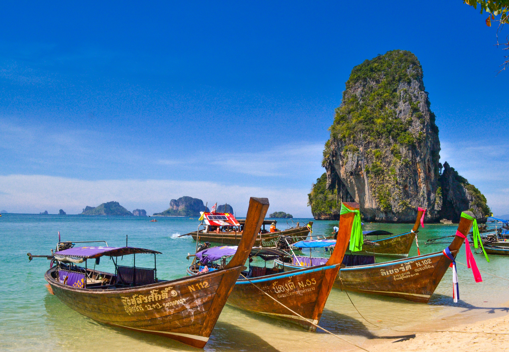

<StartWishToGo/>

# Thailand <WishWidget country="TH" picture="https://wish-to-go.com/images/for-wish-to-go/thailand/thailand-isle-beach-sumit-chinchane-jWKk-0ZBUyg-unsplash.jpg"/>

Thailand is a huge country full of unexpected experiences. It is the most popular destination in Southeast Asia. People go there for many reasons, a flourish economy, stunning landscapes, tropical beaches, nice people or excellent food. It is a very easy country to move around. Transport infrastructures are pretty good and modern, and they have a long well established tourist industry. This makes the traveller feel like at home despite the language, the ancestral traditions or the exotic countenance of their people. They call themself _The Country of Smiles_, and they are not wrong. Since they are children they are taught to smile nicely by parents, uncles and friends. So be ready to enjoy a unique experience that many visitors will never forget.

<ShareTripWidget user-id="5RgbbnW5uDZV0sofyNe3NWws1qs1" trip-name="Wish To Go Trip to Thailand" icon-url="/images/blogger.png"/>

<CustomCategoryEntries className="blog-entry-card" category="city" tags="Thailand"/>

## Popular Destinations

- [Bangkok](/travel/thailand/bangkok) <WishWidget	country="TH" city="Bangkok" picture="https://wish-to-go.com/images/for-wish-to-go/thailand/bangkok-yaowarat-florian-wehde--y3sidWvDxg-unsplash.jpg"></WishWidget>

	- [Grand Palace and Emerald Buddha](/travel/thailand/bangkok/#grand-palace-and-emerald-buddha) <WishWidget	country="TH" city="Bangkok" activity="Grand Palace"	picture="https://wish-to-go.com/images/for-wish-to-go/thailand/grand-palace-bangkok-thailand.jpg"></WishWidget>

	- [Wat Pho](/travel/thailand/bangkok/#wat-pho) <WishWidget	country="TH" city="Bangkok" activity="Wat Pho"></WishWidget>

	- [Wat Arun](/travel/thailand/bangkok/#wat-arun) <WishWidget	country="TH" city="Bangkok" activity="Wat Arun"></WishWidget>

- [The North and the mountains](/travel/thailand/the-north-and-the-mountains-of-thailand)

	- [Chiang Mai](/travel/thailand/the-north-and-the-mountains-of-thailand/#chiang-mai) <WishWidget	country="TH"	city="Chiang Mai"	picture="https://wish-to-go.com/images/for-wish-to-go/thailand/silver-temple-chiang-mai-thailand-peter-borter-Hz-N7tCgCUo-unsplash.jpg"></WishWidget>

	- [Doi Intanon](/travel/thailand/the-north-and-the-mountains-of-thailand/#other-places-to-visit) <WishWidget	country="TH" city="Chiang Mai" activity="Doi Intanon"></WishWidget>

	- [Doi Suthep](/travel/thailand/the-north-and-the-mountains-of-thailand/#other-places-to-visit) <WishWidget country="TH"	city="Chiang Mai"	activity="Doi Suthep"></WishWidget>

	- [Pai](/travel/thailand/the-north-and-the-mountains-of-thailand/#other-places-to-visit) <WishWidget	country="TH"	city="Pai"	picture="https://wikitravel.org/upload/shared//thumb/e/ec/Huai_Nam_Dang_National_Park.jpg/300px-Huai_Nam_Dang_National_Park.jpg"></WishWidget>

- The South and the islands.

- The East and the quiet beaches

## Other Countries

<CustomCategoryEntries className="blog-entry-card more-of" category="country"/>