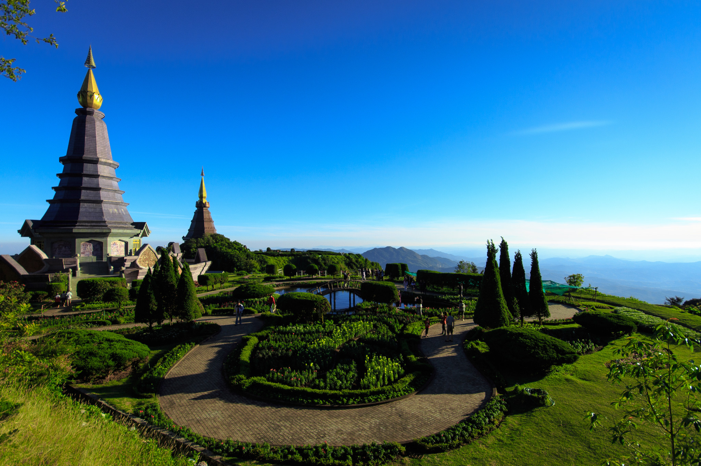
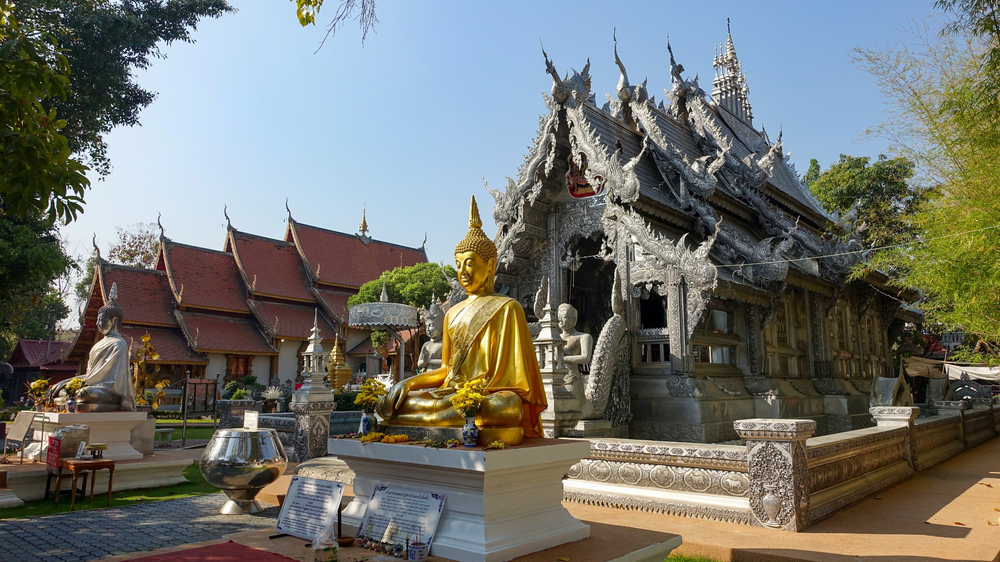

<StartWishToGo/>

# The North and the mountains of Thailand

This National Park in Chiang Mai province, known as the Roof of Thailand, covers a total area of 472 km2. Its highest peak, Doi Inthanon, rises up to 2565 m, so you will find yourself all year round with cold weather and a fairly high humidity rate. Don't forget to take a jacket, as normally here the temperature does not exceed 10º. A nice contrast if you come flattened by the heat of Chiang Mai city.

Doi Inthanon is named after King Inthawichayanon (also called Inthanon), one of the last kings of Chiang Mai (he reigned at the end of the 19th century). This environmentally conscious king was no stranger to the importance of preserving this natural legacy for future generations, and in honor of all the actions he took to preserve this ecosystem, the park was renamed. Respecting his wish, his mortal remains rest today in the park's grounds.

## Chiang Mai
<WishWidget	country="TH"	city="Chiang Mai"	picture="https://wish-to-go.com/images/for-wish-to-go/travel/thailand/silver-temple-chiang-mai-thailand-peter-borter-Hz-N7tCgCUo-unsplash.jpg" label/>

Chiang Mai is located in the north of Thailand and is one of the must-see places to visit in the country. Visiting some of its more than 300 temples, doing some multi-day trekking, cooking courses or its already famous shopping at the Night Bazaar are just a small example of what you can do in Chiang Mai.

The city of Chiang Mai is very well-prepared for the tourist, nobody who is proud can say that they got bored in it. The range of activities is quite wide. However, the most common thing to do is to visit the many temples in the city. Having said that, in our opinion 3 days are more than enough to visit Chiang Mai with peace of mind.

## Other places to visit

- Doi Intanon <WishWidget	country="TH" city="Chiang Mai" activity="Doi Intanon" picture="/home/jseto/programing-projects/web/tsa/site-wish-to-go/static/images/for-wish-to-go/travel/thailand/doi-intanon-thailand-Naphamethinidon,_Naphaphonphumisiri_near_summit_of_Doi_Inthanon.jpg/>

- Doi Suthep <WishWidget country="TH"	city="Chiang Mai"	activity="Doi Suthep"></WishWidget>

- Pai <WishWidget	country="TH"	city="Pai"	picture="https://wikitravel.org/upload/shared//thumb/e/ec/Huai_Nam_Dang_National_Park.jpg/300px-Huai_Nam_Dang_National_Park.jpg"></WishWidget>

## More of Thailand

<CategoryEntries className="blog-entry-card more-of" category="city" tags="Thailand"/>